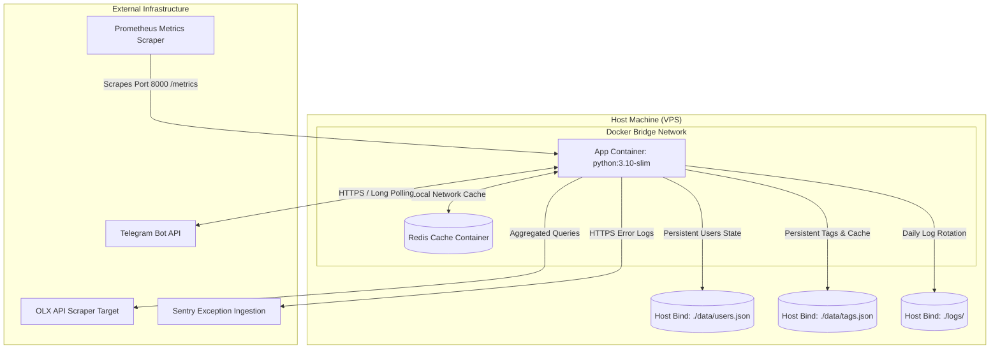

# 🛡️ Asynchronous OLX Tracker & DevSecOps Showcase

### 🚀 Production-Grade DevOps, Infrastructure Security & Observability Case Study

This public repository serves as the architecture design study and code showcase for a proprietary, containerized asynchronous Telegram bot system designed to monitor the public OLX Ukraine API for listings in real time, evaluate deals using pluggable LLMs, and cache parsed states.

The repository showcases **DevSecOps security pipelines, hybrid Redis-JSON storage adapters, runtime-pluggable AI strategies, telemetry metrics, and secure access control models** utilized in the production environment.

> [!NOTE]
> **Portfolio Showcase Notice:** The core business scraping logic is proprietary and kept in a private repository. This repository showcases the **system architecture, DevSecOps infrastructure, Docker bridge isolation, whitelisting security middlewares, Prometheus metrics, and design patterns** used to run the system in production.

---

## 🛡️ Security & Access Control (DevSecOps)

### 1. Zero-Trust Access Control Middleware (ACL)
Incoming Telegram updates pass through an asynchronous `ACLMiddleware` before reaching handler routers:
* On every interaction, the user's Telegram ID, username, and language preference are logged in the database (`users.json`).
* Rejects unauthorized requests early in the pipeline to prevent CPU/RAM spam.
* Allows administrators to review all logged interactions and dynamically authorize users.

### 2. Dynamic Bot Command Menu Scoping
To prevent exposure of administrative features, the Bot Command Menu is scoped dynamically at runtime:
* **Default Scope**: Standard users see a menu containing only basic commands (`/newtag`, `/newpremium`, `/tags`, `/check`, `/language`, `/help`).
* **Admin Scope**: Admins and Superadmins dynamically receive a customized command menu containing `/admin` using Telegram's native `BotCommandScopeChat`.
* **Flow Integration**: Menu registers and deletes automatically when roles are granted or revoked via the admin panel.

### 3. Role-Based Access Control (RBAC)
Granular user privilege classification protects critical management endpoints:
* **Superadmin**: Primary hardcoded administrator (configured via `.env`) with exclusive rights to promote or demote admins.
* **Admin**: Authorized to manage the user whitelist, clear parse caches, and monitor metrics.
* **User**: Limited to setting standard search query keyword trackers.

---

## 🛠️ DevOps & Observability Architecture

### 1. Multi-Service Container Orchestration (`docker-compose`)
The system runs on an isolated Docker bridge network, ensuring DB services communicate securely without exposing ports to the public host interface, except for designated Prometheus ports.
* **App Container**: Runs the asynchronous Telegram bot, background scanner loop, and HTTP metrics server.
* **Redis Container**: Acts as the primary parsed item registry.
* **Host Volumes**: Persistent bind-mounts directory `/app/data/` for local databases and `/app/logs/` for log rotations.

### 2. DevSecOps GitHub Actions Pipeline (`security.yml`)
Automated security audits run on every push and pull request to enforce quality gates:
* **SAST (Bandit)**: Recursively scans code for common vulnerabilities (such as hardcoded secrets, unsafe execution, or insecure imports).
* **SCA (pip-audit)**: Audits third-party Python packages against known CVE vulnerability databases.
* **Linter (Ruff)**: Performs static analysis checking for unused code, variables, and formatting.

### 3. Telemetry & Prometheus Exporter
Runs an HTTP metrics server on port `8000`, exposing key system telemetry for Prometheus scraping:
* `olx_scraped_offers_total` — Counter tracking total OLX offers fetched from the API.
* `olx_matched_offers_total{type}` — Counter of offers matching user tags, labeled `standard` / `premium`.
* `olx_scanner_iterations_total` — Counter tracking total background scanner loop iterations.
* `olx_active_tags{type}` — Gauge monitoring active tracked queries, labeled `standard` / `premium`.
* `olx_errors_total{type}` — Counter detailing exceptions, labeled by failure category (e.g. `scanner_loop`).
* When `ENABLE_METRICS=False`, a Null Object fallback (`DummyMetric`) transparently absorbs all `.inc()` / `.set()` / `.labels()` calls, so the app runs identically with metrics on or off — no conditional checks scattered through the codebase.

### 4. Hybrid Database & Failover Adapter
* **Primary Caching**: High-speed memory storage using Redis with a **14-day Time-To-Live (TTL)** key policy.
* **Failover Storage**: Automatically falls back to local thread-safe JSON files if the Redis connection fails, ensuring 100% uptime.
* **Split JSON architecture**: Divides storage into `users.json` (infrequent writes) and `tags.json` (frequent updates) to prevent high-frequency disk I/O lock collisions.

---

## 🏗️ Infrastructure & Network Topology



---

## 💎 Software Design Showcase (Exposed Code)

### 1. Strategy Pattern (Pluggable AI)
Polymorphic LLM gateways inherit from a common `BaseAIClient` interface, allowing hot-swapping providers (OpenAI, Gemini, Ollama, or Mock) without modifications to the scraper logic. Every network-backed strategy fails gracefully back to `MockAIClient` on timeout, HTTP error, or malformed response — the bot never crashes on an AI provider outage.
* See [architecture/ai_client_interface.py](architecture/ai_client_interface.py).

### 2. Cache Adapter Pattern
Decouples state checks from the storage engine, coordinating async Redis queries and local storage fallback. Disk writes go through a temp-file-then-`os.replace()` sequence, so a crash mid-write can never leave a corrupted, half-written database file behind.
* See [architecture/database_interface.py](architecture/database_interface.py).

---

## ⚙️ Configuration & Environment Variables

| Variable | Description | Expected Value / Default | Required |
| :--- | :--- | :--- | :--- |
| `BOT_TOKEN` | Telegram bot token obtained from `@BotFather`. | String (`123456789:ABC...`) | **Yes** |
| `SUPERADMIN_ID` | Telegram user ID of the super administrator. | User ID Integer (`7557555258`) | **Yes** |
| `DB_USERS_FILE` | Path to persistent users config. | Path String (`data/users.json`) | No |
| `DB_TAGS_FILE` | Path to persistent tags and parse cache config. | Path String (`data/tags.json`) | No |
| `POLLING_INTERVAL` | Time in seconds between OLX scanning iterations. | Integer (e.g. `10`) | No (Default: `10`) |
| `RATE_LIMIT_DELAY` | Sleep interval between queries to prevent API bans. | Float (e.g. `0.5`) | No (Default: `0.5`) |
| `PROXY_URL` | Optional HTTP proxy address for scraping. | String (`http://user:pass@ip:port`) | No |
| `AI_PROVIDER` | Pluggable LLM choice. | `mock` \| `openai` \| `gemini` \| `ollama` | No (Default: `mock`) |
| `AI_API_KEY` | API credentials key for the selected AI provider. | String | Conditional |
| `AI_MODEL` | Specific LLM model version to query. | e.g. `gpt-4o-mini`, `gemini-1.5-flash`, `llama3` | Conditional |
| `AI_BASE_URL` | Custom endpoint override (self-hosted Ollama, OpenAI-compatible proxy). | URL String | No |
| `REDIS_URL` | Connection URL for Redis caching container. | `redis://host:port/db` | No |
| `SENTRY_DSN` | Sentry DSN endpoint for real-time error logging. | `https://...@sentry.io/...` | No |
| `ENABLE_METRICS` | Enables Prometheus HTTP exporter metrics server. | `True` \| `False` | No (Default: `False`) |
| `METRICS_PORT` | Port number to expose Prometheus metrics. | Port Integer (e.g. `8000`) | No (Default: `8000`) |

---

## 📂 Repository Layout (Target System)

```
├── architecture/
│   ├── ai_client_interface.py     # LLM Strategy design (Code Showcase)
│   └── database_interface.py      # Cache with fallback design (Code Showcase)
├── handlers/                      # Update handlers and admin callback panels
├── middlewares/                   # ACL Access Control List Middleware
├── translations.py                # Dynamic UA/EN i18n layer with per-user language state
├── config.py                      # Strongly typed environment configuration
├── logger_config.py               # Asynchronous daily rotating dated logging
├── metrics.py                     # Prometheus gauges, counters, and dummy metrics fallback
├── bot.py                         # Application main startup and commands scoping
├── scanner.py                     # Asynchronous OLX API scraping loop
└── docker-compose.yml             # Orchestration for bot and Redis cache
```
